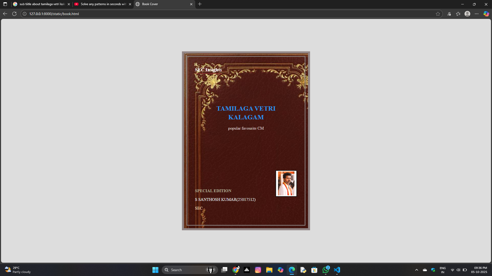

# Ex.06 Book Front Cover Page Design
## Date:5/10/25

## AIM:
To design a book front cover page using HTML and CSS.

## DESIGN STEPS:

### Step 1:
Create a Django Admin project.

### Step 2:
Create an app in the Django interface.

### Step 3:
Create a folder named 'static' in the app folder.

### Step 4:
Create a new HTML file in the static folder.

### Step 5:
Write the HTML code with relevant CSS properties.

### Step 6:
Choose the appropriate style and color scheme.

### Step 7:
Insert the images in their appropriate places.

### Step 8:
Publish the website in the LocalHost.

## PROGRAM:
```
  <html lang="en">
<head>
  <meta charset="UTF-8">
  
  <meta name="viewport" content="width=device-width, initial-scale=1.0">
  <title>Book Cover</title>
  <link rel="stylesheet" href="style.css">
</head>

<body>
  <div class="cover">
    <div class="inner-box">
      <h3 class="top">SEC Insights</h3>
      <h1 class="title">TAMILAGA VETRI<br>KALAGAM<br></h1>
      <p class="subtitle"> popular  favourite CM </p>

      <div class="bottom">
        <p class="special">SPECIAL EDITION</p>
        <div class="line"></div>
        <div class="bottom-row">
          <p class="author">S SANTHOSH KUMAR(25017512)</p>
          
          <p class="sec">SEC</p>
        </div>
      </div>
    </div>
  </div>
</body>
</html>


```


## OUTPUT:



## RESULT:
The program for designing book front cover page using HTML and CSS is completed successfully.
